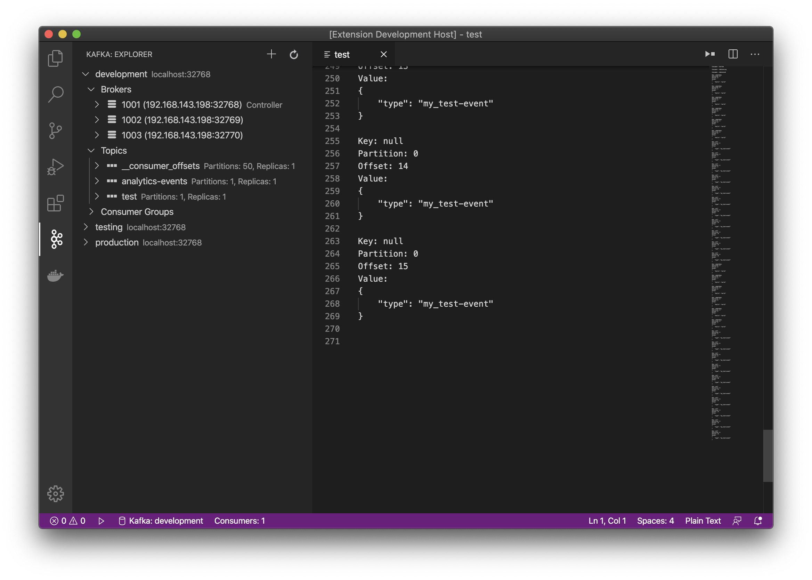

# Kafka extension for Visual Studio Code

[](https://github.com/jlandersen/vscode-kafka/actions?query=workflow%3ACI+branch%3Amaster)
[](https://marketplace.visualstudio.com/items?itemName=jeppeandersen.vscode-kafka)
[](https://marketplace.visualstudio.com/items?itemName=jeppeandersen.vscode-kafka)

Work with Kafka directly in Visual Studio Code. Kafka clusters running version 0.11 or higher are supported.

Features:
- Connect to multiple clusters
- View brokers in cluster
- View topics
- View configs
- Create/Delete topic
- Producing (randomized) messages
- Consuming messages
- SASL/PLAIN, SASL/SCRAM-256, SASL/SCRAM-512 Authentication (Kafka 0.10+)

Planned features in no particular order:
- More administration features
- Update configs

You might also find useful information in the [Online Documentation](https://github.com/jlandersen/vscode-kafka/blob/master/docs/README.md)
or you can read this documentation inside your editor with the command `Open Documentation` available with `Ctrl+Shift+P`:


## Kafka explorer

The Kafka explorer shows configured clusters with their topics, brokers, consumers and configurations.




See [Kafka explorer](https://github.com/jlandersen/vscode-kafka/blob/master/docs/Explorer.md) section for more informations.

## Producing messages

Producing can be done by creating a `.kafka` file. Write simple producers using the following format:

```json
PRODUCER keyed-message
topic: my-topic
key: mykeyq
record content

###

PRODUCER non-keyed-json-message
topic: json-events
{
    "type": "my_test_event"
}
```


See [Producing messages](https://github.com/jlandersen/vscode-kafka/blob/master/docs/Producing.md) section for more informations.

## Consuming messages

Consuming topics can be done by right clicking a topic in the explorer or from the command palette.  

See [Consuming messages](https://github.com/jlandersen/vscode-kafka/blob/master/docs/Consuming.md) section for more informations.

## CI Builds

vscode-kafka is built using Github Actions. Here's how to download and install the latest successful build:
- Go to the [CI Workflow page](https://github.com/jlandersen/vscode-kafka/actions?query=workflow%3ACI+is%3Asuccess+branch%3Amaster)
- Click on the most recent run,
- Locate the vscode-kafka artifact down the page and download it,
- Unzip the archive,
- Install the vscode-kafka-*.vsix extension by following these [instructions](https://code.visualstudio.com/docs/editor/extension-gallery#_install-from-a-vsix).