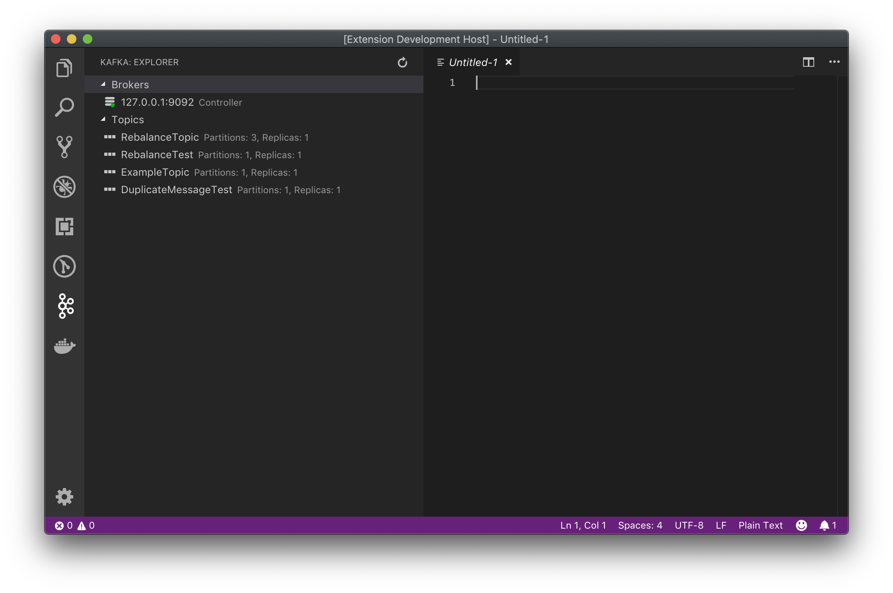
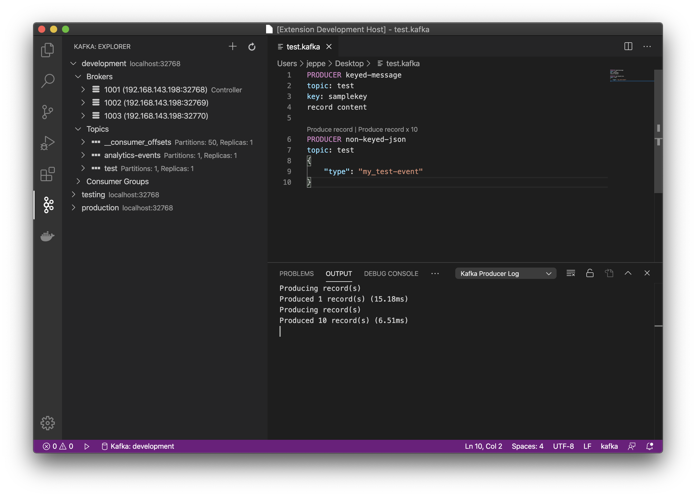
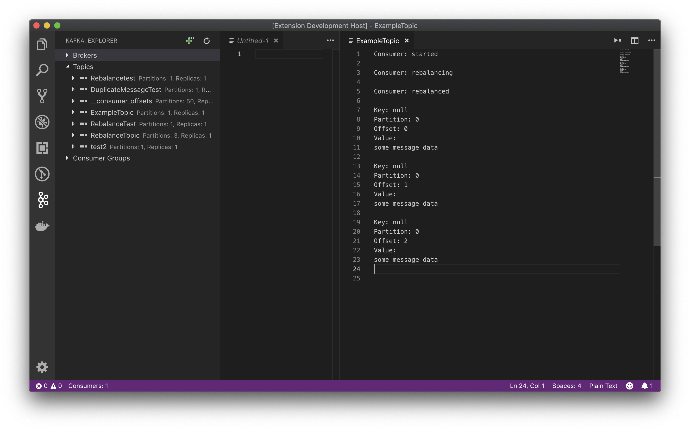

# Kafka extension for Visual Studio Code

[](https://github.com/jlandersen/vscode-kafka/actions?query=workflow%3ACI+branch%3Amaster)
[](https://marketplace.visualstudio.com/items?itemName=jeppeandersen.vscode-kafka)
[](https://marketplace.visualstudio.com/items?itemName=jeppeandersen.vscode-kafka)

Work with Kafka directly in Visual Studio Code. Kafka clusters running version 0.11 or higher are supported.

Features:
- Connect to multiple clusters
- View brokers in cluster
- View topics
- View configs
- Create topic
- Producing
- Consuming
- SASL/PLAIN Authentication (Kafka 0.10+)

Planned features in no particular order:
- More administration features (delete topics)
- Update configs

## Screenshots






## Producing
Producing can be done by creating a `.kafka` file. Write simple producers using the following format:

```json
PRODUCER keyed-message
topic: my-topic
key: mykeyq
record content

###

PRODUCER non-keyed-json-message
topic: json-events
{
    "type": "my_test_event"
}
```

Record content can be randomized by injecting mustache-like placeholders of [kafka.js properties](https://github.com/Marak/faker.js#api-methods), like ``{{name.lastName}}`` or ``{{random.number}}``. Some randomized properties can be localized via the `kafka.producers.fakerjs.locale` setting.


## Consuming
Consuming topics can be done by right clicking a topic in the explorer or from the command palette.  Some things to note about consuming:

* UTF-8 encoded keys and values only. If data is encoded differently, it will not be pretty.
* One consumer group is created per topic (may change in the future to just have one for the extension).

Consumers are based on virtual documents, available in the VS Code extension API. A consumer will keep running even if you close the document in the editor. You should make sure to close the consumer explicitly, either via the command palette, the status bar element or the start/stop action button as well. The VS Code API does not support detecting if a virtual document is closed immediately. Instead, the underlying virtual document is automatically closed after two minutes if the document is closed in the editor.

You can configure start offset for new consumers in settings (earliest, latest).
