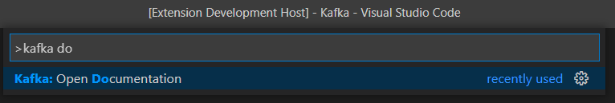

# Tools for Apache Kafka®

[](https://github.com/jlandersen/vscode-kafka/actions?query=workflow%3ACI+branch%3Amaster)
[](https://marketplace.visualstudio.com/items?itemName=jeppeandersen.vscode-kafka)
[](https://marketplace.visualstudio.com/items?itemName=jeppeandersen.vscode-kafka)

Work with Apache Kafka® directly in Visual Studio Code-based editors. Kafka clusters running version 0.11 or higher are supported.

Features:
- Connect to multiple clusters
- View brokers in cluster
- View topics
- View configs
- Create/Delete topic
- Produce (randomized) messages
- Consume messages
- SASL/PLAIN, SASL/SCRAM-256, SASL/SCRAM-512 Authentication (Kafka 0.10+)
- Clusters can be contributed by 3rd party extensions

Planned features, in no particular order:
- More administration features
- Improved new cluster wizard
- Improved .kafka validation support
- SSL support

You might also find useful information in the [Online Documentation](https://github.com/jlandersen/vscode-kafka/blob/master/docs/README.md)
or you can read this documentation inside your editor with the command `Open Documentation` available with `Ctrl+Shift+P`:



## Kafka explorer

The Kafka explorer shows configured clusters with their topics, brokers, consumers and configurations.


See [Kafka explorer](https://github.com/jlandersen/vscode-kafka/blob/master/docs/Explorer.md) section for more information.

## Producing messages

Define simple producers in a [.kafka](https://github.com/jlandersen/vscode-kafka/blob/master/docs/KafkaFile.md#kafkafile) file, using the following format:

```json
PRODUCER keyed-message
topic: my-topic
key: mykeyq
record content

###

PRODUCER non-keyed-json-message
topic: json-events
{
    "type": "my_test_event-{{random.number}}"
}
```


See [Producing messages](https://github.com/jlandersen/vscode-kafka/blob/master/docs/Producing.md) section for more information.

## Consuming messages

Consuming topics can be done by right-clicking on a topic in the Kafka explorer, from the command palette, or from a [.kafka](https://github.com/jlandersen/vscode-kafka/blob/master/docs/KafkaFile.md#kafkafile) file:

```
CONSUMER consumer-group-id
topic: json-events
partitions: 0
from: 1
```


See [Consuming messages](https://github.com/jlandersen/vscode-kafka/blob/master/docs/Consuming.md) section for more information.

## Discover new cluster providers

You can search for extensions contributing cluster providers in the extension gallery, by clicking on the `Discover Cluster Providers` button (also available via the command palette):


Those extensions must have the `kafka-provider` keyword in their `package.json`, eg.
```json
"keywords": [
		"kafka-provider"
],
```

## CI Builds

_Tools for Apache Kafka®_ is built using Github Actions. Here's how to download and install the latest successful build:
- Go to the [CI Workflow page](https://github.com/jlandersen/vscode-kafka/actions?query=workflow%3ACI+is%3Asuccess+branch%3Amaster)
- Click on the most recent run,
- Locate the vscode-kafka artifact down the page and download it,
- Unzip the archive,
- Install the vscode-kafka-*.vsix extension by following these [instructions](https://code.visualstudio.com/docs/editor/extension-gallery#_install-from-a-vsix).

## License
MIT License. See [LICENSE](LICENSE) file.

Apache, Apache Kafka®, Kafka® and associated logos are trademarks of the Apache Software Foundation (ASF). _Tools for Apache Kafka®_ is not affiliated with, endorsed by, or otherwise associated with the Apache Software Foundation or any of its projects.
