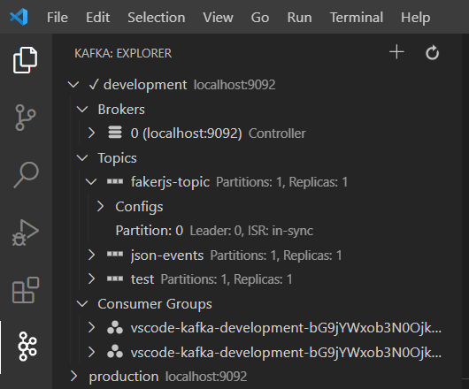
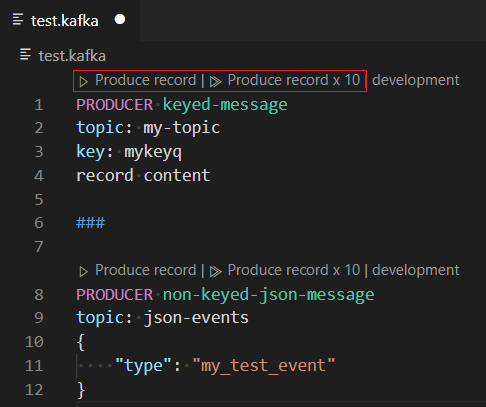
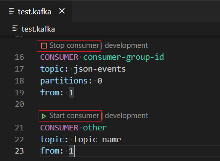
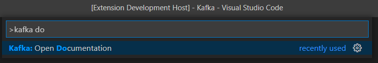
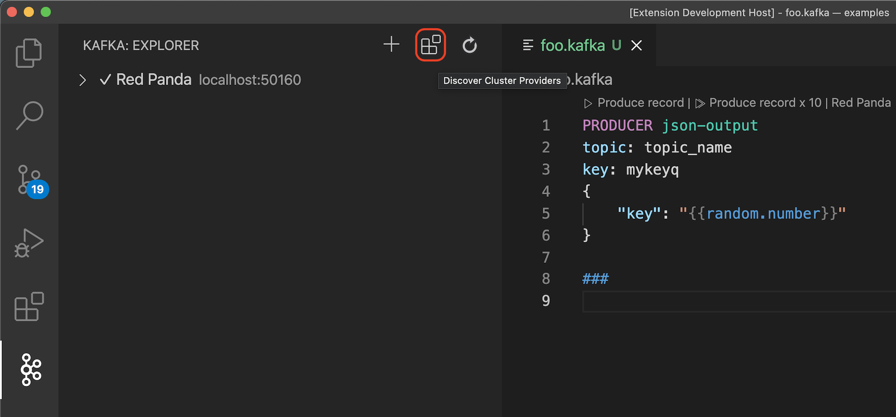

# Tools for Apache Kafka®

[](https://github.com/jlandersen/vscode-kafka/actions?query=workflow%3ACI+branch%3Amaster)
[](https://marketplace.visualstudio.com/items?itemName=jeppeandersen.vscode-kafka)
[](https://marketplace.visualstudio.com/items?itemName=jeppeandersen.vscode-kafka)

**Interact with Apache Kafka® directly in VS Code.** Manage clusters, produce and consume messages, and explore topics.

---

## ✨ Key Features

### 🔍 **Visual Cluster Explorer**
Browse your Kafka infrastructure in the sidebar:
- 📊 **Clusters** - Connect to multiple Kafka clusters simultaneously
- 📂 **Topics** - View, create, and delete topics with real-time updates
- 🖥️ **Brokers** - Monitor broker health and configuration
- 👥 **Consumer Groups** - Track consumer lag and group membership
- ⚙️ **Configurations** - Inspect and manage cluster settings



### 📤 **Message Producer**
Create producers using simple `.kafka` files with rich features:
- 🎲 **Randomized Data** - Generate test data with [Faker.js](https://fakerjs.dev/) templates
- 🔑 **Headers & Keys** - Full support for message keys and custom headers
- ⏱️ **Scheduled Production** - Produce messages at regular intervals (`every: 5s`, `every: 1m`)
- 🔁 **Batch Production** - Send multiple messages at once for load testing
- 🎯 **Multiple Producers** - Define multiple producers in a single file
- ✅ **JSON Schema Validation** - Validate `value-format: json` payloads with inline schema or `file(...)` reference

**Example:**
```kafka
PRODUCER user-events
topic: user-activity
every: 3s
key: user-{{string.uuid}}
headers: source=web-app, version=1.0
{
  "userId": "{{string.uuid}}",
  "event": "{{helpers.arrayElement(['login', 'logout', 'purchase'])}}",
  "timestamp": {{$timestamp}},
  "user": {
    "name": "{{person.fullName}}",
    "email": "{{internet.email}}"
  }
}
```

**JSON with schema validation:**
```kafka
PRODUCER
topic: user-events
value-format: json
value-schema: {"type":"object","required":["id"],"properties":{"id":{"type":"number"}}}
{"id":1}
```

Or from file:
```kafka
value-schema: file(./schemas/user-event.schema.json)
```



### 📥 **Flexible Consumer**
Consume messages with multiple visualization options:
- 📝 **Text View** - Traditional streaming text output with syntax highlighting
- 📊 **Table View** - Excel-like table with sortable columns, search, and CSV export
- 🎯 **Targeted Consumption** - Consume from specific partitions or offsets
- 💾 **Export Data** - Export consumed messages to CSV for analysis

**Start consuming from:**
- Right-click a topic in the explorer
- Use Command Palette (`Ctrl+Shift+P`)
- Define consumers in `.kafka` files

```kafka
CONSUMER analytics-team
topic: user-events
from: earliest
partitions: 0,1,2
```



### 🔐 **Security**
- 🔒 **SASL Authentication** - PLAIN, SCRAM-256, SCRAM-512 (Kafka 0.10+)
- 🌐 **OAUTHBEARER** - OAuth 2.0 authentication with automatic token refresh
- ☁️ **AWS MSK IAM** - Native AWS IAM authentication for Amazon MSK clusters
- 🛡️ **SSL/TLS Support** - Secure connections with certificate validation
- 🔑 **Secure Storage** - Credentials stored in OS keychain (macOS Keychain, Windows Credential Manager, Linux Secret Service)
- 🧪 **Development Mode** - Optional hostname verification bypass for self-signed certificates

### 🛠️ **Advanced Administration**
- ✅ **Create Topics** - Configure partitions, replication factor, and topic settings
- 🗑️ **Delete Topics** - Remove unwanted topics with confirmation dialogs
- 🧹 **Delete Records** - Empty topics by deleting all messages from all partitions
- 📋 **Metadata Inspection** - Dump detailed metadata for clusters, brokers, and topics
- 👥 **Consumer Group Management** - Delete consumer groups and monitor offsets

---

## 🚀 Getting Started

### 1. Install the Extension
Search for "Kafka" in the VS Code Extensions marketplace or [install from here](https://marketplace.visualstudio.com/items?itemName=jeppeandersen.vscode-kafka).

### 2. Add Your First Cluster
Click the `+` icon in the Kafka Explorer or use `Ctrl+Shift+P` → "Kafka: Add Cluster"

### 3. Start Exploring!
- Browse topics and consumer groups
- Right-click to produce or consume messages
- Create `.kafka` files for reusable workflows

> 📚 **Need Help?** Open documentation inside VS Code with `Ctrl+Shift+P` → "Kafka: Open Documentation"



---

## 📖 Documentation

| Topic | Description |
|-------|-------------|
| [Kafka Explorer](https://github.com/jlandersen/vscode-kafka/blob/master/docs/Explorer.md) | Navigating clusters, topics, brokers, and consumer groups |
| [Producing Messages](https://github.com/jlandersen/vscode-kafka/blob/master/docs/Producing.md) | Creating producers with Faker templates and scheduled production |
| [Consuming Messages](https://github.com/jlandersen/vscode-kafka/blob/master/docs/Consuming.md) | Text view, table view, and consumption options |
| [.kafka File Format](https://github.com/jlandersen/vscode-kafka/blob/master/docs/KafkaFile.md) | Syntax reference for producer and consumer definitions |
| [Settings](https://github.com/jlandersen/vscode-kafka/blob/master/docs/Settings.md) | Extension configuration options |

---

## 🔌 Extensibility

Extend the Kafka explorer by creating custom cluster providers. Your extension can:
- Discover clusters from external sources (cloud providers, configuration management)
- Auto-configure connection settings
- Provide custom authentication mechanisms

**Create a Cluster Provider Extension:**
1. Add `"kafka-provider"` to your extension's `package.json` keywords
2. Implement the cluster provider API
3. Users discover your extension via "Discover Cluster Providers"



---

## 🤝 Contributing

We ❤️ contributions! Whether you're:
- 🐛 Reporting bugs
- 💡 Suggesting features
- 📝 Improving documentation
- 💻 Submitting pull requests

All contributions are welcome! See [CONTRIBUTING.md](CONTRIBUTING.md) for guidelines.

### Development Setup
1. Clone the repository
2. Run `npm install`
3. Open in VS Code and press `F5` to launch Extension Development Host
4. Make your changes and run tests with `npm test`

---

## 📦 CI Builds

Try the latest development version:
1. Go to the [CI Workflow page](https://github.com/jlandersen/vscode-kafka/actions?query=workflow%3ACI+is%3Asuccess+branch%3Amaster)
2. Click on the most recent successful run
3. Download the `vscode-kafka` artifact
4. Unzip and install the `.vsix` file: `code --install-extension vscode-kafka-*.vsix`

---

## 📄 License

MIT License. See [LICENSE](LICENSE) file.

---

## ⚖️ Legal

Apache, Apache Kafka®, Kafka® and associated logos are trademarks of the Apache Software Foundation (ASF). _Tools for Apache Kafka®_ is not affiliated with, endorsed by, or otherwise associated with the Apache Software Foundation or any of its projects.
