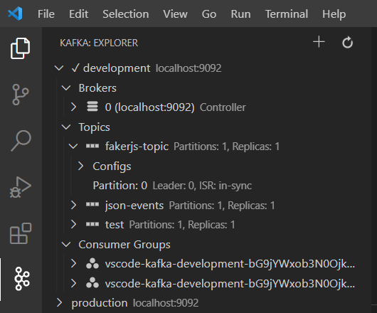
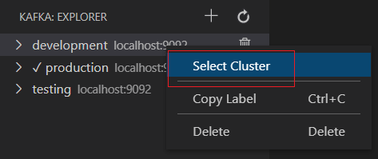
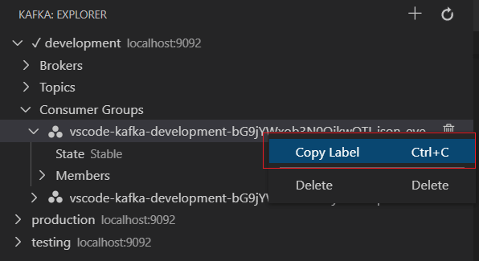
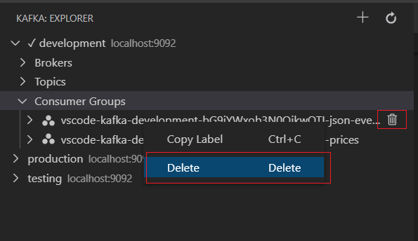
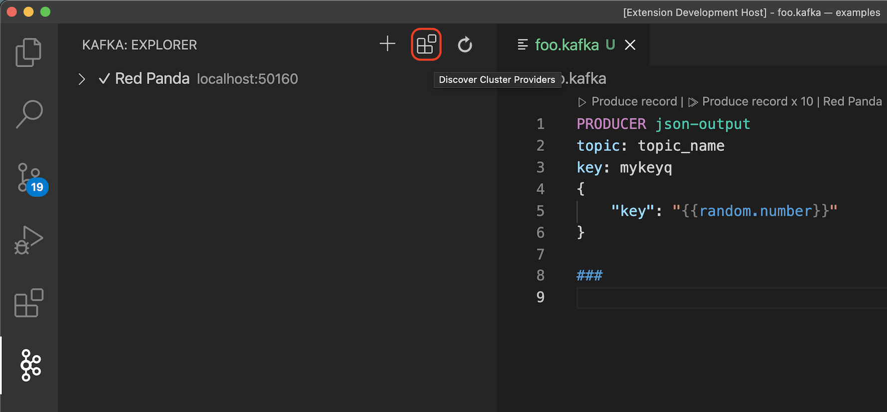

# Explorer

The Kafka explorer shows configured clusters with their topics, brokers, consumers and configurations.



## Cluster Item

In the Kafka explorer, right-click on a cluster to access several options.

### Select Cluster

Before using a [.kafka file](KafkaFile.md#kafkafile), a cluster must be selected, you can use the `Select cluster` menu item:



## Actions

### Copy Label

You can copy the label of any tree node in the clipboard with `Ctrl+C` (`Cmd+C` on Mac) or  via the `Copy Label` contextual menu:



### Delete

You can delete clusters, topics and consumer groups with the `Delete` (`Cmd+Delete` on Mac) key, the `Trashcan` icon or `Delete` contextual menu:



Multiple delete is not supported for the moment. See [issue 107](https://github.com/jlandersen/vscode-kafka/issues/107).

To delete a consumer group, it first must be stopped, else the `Delete` action will report an error.

## Discover new cluster providers

You can search for extensions contributing cluster providers in the extension gallery, by clicking on the `Discover Cluster Providers` button (also available via the command palette):



Those extensions must have the `kafka-provider` keyword in their `package.json`, eg.
```json
"keywords": [
		"kafka-provider"
],
```

## Preferences

### `kafka.explorer.topics.sort`

Choose sorting for topics in explorer.

### `kafka.explorer.topics.filter`

Glob patterns filtering topics out of the Kafka explorer. `*` matches any string, `?` matches a single character.

### `kafka.explorer.consumers.filter`

Glob patterns filtering consumer groups out of the Kafka explorer. `*` matches any string, `?` matches a single character.