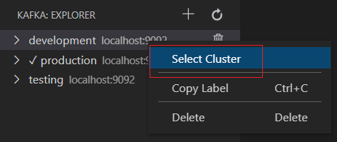
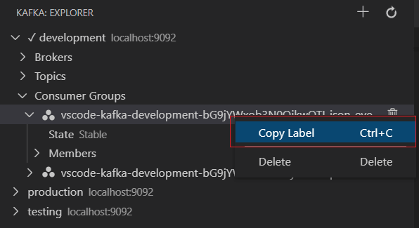
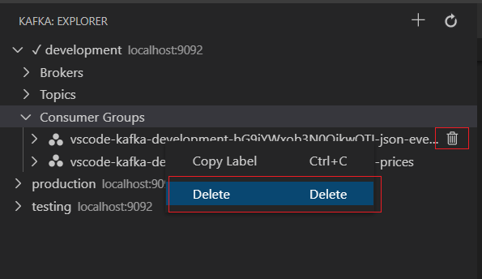

# Explorer

The Kafka explorer has two root groups:

- `Clusters`
- `Schema Registries`

The `Clusters` tree shows configured clusters with their topics, brokers, consumers and configurations.


## Cluster Item

In the Kafka explorer, right-click on a cluster to access several options.

If a cluster has a linked Schema Registry, the cluster tree also shows:

`Schema Registries -> <Registry Name> -> Subjects -> Versions`

### Select Cluster

Before using a [.kafka file](KafkaFile.md#kafkafile), a cluster must be selected, you can use the `Select cluster` menu item:



## Schema Registry Connections

Schema Registry connections are configured separately from clusters and can be reused across clusters.

- Define registry connections in `kafka.schemaRegistries`.
- Link a cluster to a registry by setting `schemaRegistryId` in the cluster config.
- Credentials are stored in secure storage, not plain settings.

Schema Registry connections can be managed directly in the explorer and command palette:

- `Kafka: Add Schema Registry`
- `Kafka: Edit Schema Registry`
- `Kafka: Delete Schema Registry`
- `Kafka: Link Cluster to Schema Registry`
- `Kafka: Unlink Cluster from Schema Registry`

Example:

```json
"kafka.schemaRegistries": [
    {
        "id": "local-registry",
        "name": "Local Registry",
        "connection": {
            "url": "http://localhost:8081",
            "namingStrategy": "TopicNameStrategy",
            "auth": {
                "username": "user"
            }
        }
    }
],
"kafka.clusters": [
    {
        "id": "local-cluster",
        "name": "Local Cluster",
        "bootstrap": "localhost:9092",
        "schemaRegistryId": "local-registry"
    }
]
```

### Topic Subject Discovery by Naming Strategy

Topic subject discovery under `Topics -> <topic> -> Schema Subjects` depends on the configured schema naming strategy:

- `TopicNameStrategy`: deterministic lookup of `<topic>-key` and `<topic>-value`.
- `TopicRecordNameStrategy`: deterministic lookup of subjects prefixed with `<topic>-`.
- `RecordNameStrategy`: best-effort heuristic matching only.
  - A single heuristic match is shown.
  - Multiple matches are treated as ambiguous and shown as an informational message instead of listing potentially incorrect subjects.

## Actions

### Copy Label

You can copy the label of any tree node in the clipboard with `Ctrl+C` (`Cmd+C` on Mac) or  via the `Copy Label` contextual menu:



### Delete

You can delete clusters, topics and consumer groups with the `Delete` (`Cmd+Delete` on Mac) key, the `Trashcan` icon or `Delete` contextual menu:



Multiple delete is not supported for the moment. See [issue 107](https://github.com/jlandersen/vscode-kafka/issues/107).

To delete a consumer group, it first must be stopped, else the `Delete` action will report an error.

## Discover new cluster providers

You can search for extensions contributing cluster providers in the extension gallery, by clicking on the `Discover Cluster Providers` button (also available via the command palette):


Those extensions must have the `kafka-provider` keyword in their `package.json`, eg.
```json
"keywords": [
		"kafka-provider"
],
```

## Preferences

### `kafka.explorer.topics.sort`

Choose sorting for topics in explorer.

### `kafka.explorer.topics.filter`

Glob patterns filtering topics out of the Kafka explorer. `*` matches any string, `?` matches a single character.

### `kafka.explorer.consumers.filter`

Glob patterns filtering consumer groups out of the Kafka explorer. `*` matches any string, `?` matches a single character.
