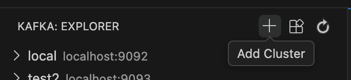
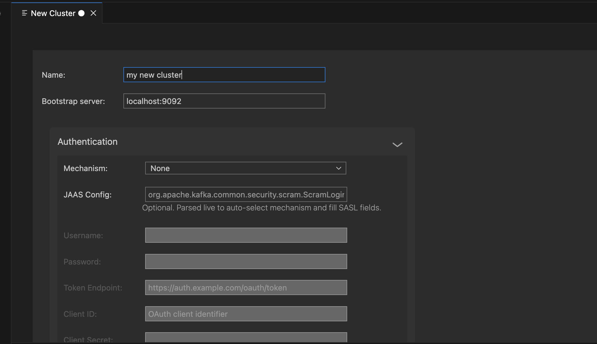

# Getting Started

To start using the extension, create your first Kafka cluster from the Explorer.

## Create your first cluster

Click the `+` icon in the Kafka Explorer, or run `Kafka: Add Cluster` from the command palette.

The Cluster Wizard opens and guides you through the required settings, like cluster name, bootstrap servers, and authentication.

Save the configuration to connect and start exploring topics, brokers, and consumer groups.
