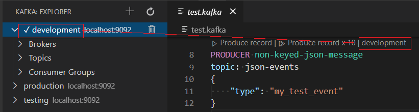
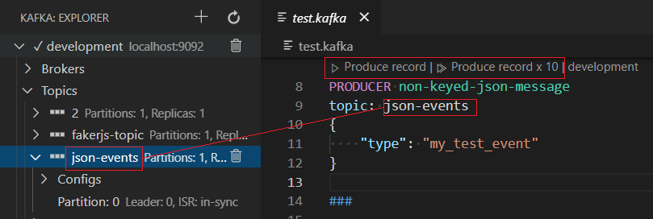
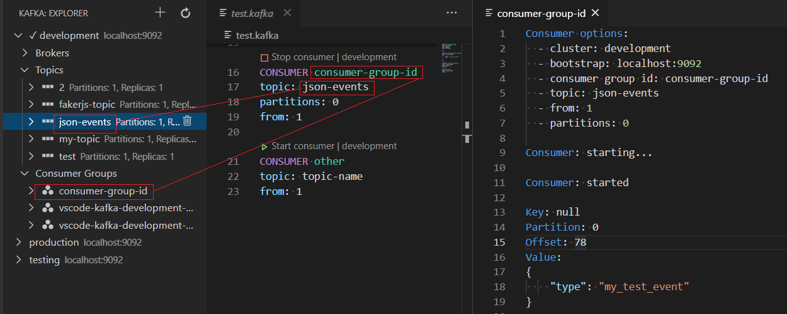
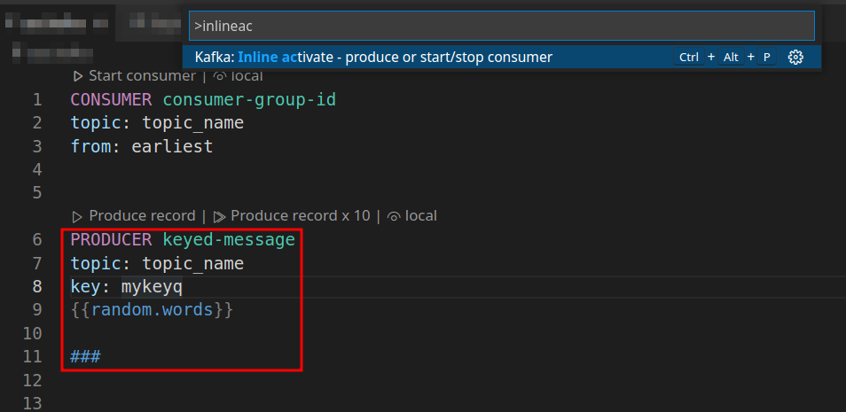

# Kafka file

A Kafka file is a file with  the `.kafka` file extension. It provides, for the currently selected cluster, the ability to declare:

 * [PRODUCER](#PRODUCER) to produce records.
 * [CONSUMER](#CONSUMER) to start /stop a consumer group.

## Select cluster

Before performing actions from a `.kafka` file, a cluster must be selected:

Once a cluster has been selected, the following codelens will appear in the `.kafka` file:

## PRODUCER

Declare `PRODUCER` blocks to easily produce records:

 
See [Producing messages](Producing.md#producing) for more information.

## CONSUMER

Declare `CONSUMER` blocks  to start/stop consumer groups on a topic, with optional group id, offset and partitions attributes:

See [Consuming messages](Consuming.md#kafka-file) for more information.

## Inline activation

Its possible to trigger the `CONSUMER` and `PRODUCER` blocks without clicking on codelens (without using the mouse).

Use the `Inline activate - produce or start/stop consumer` command to activate the block the cursor is currently in.

Notice the cursor is inside the red block

