# Producing messages

Define simple producers in a [.kafka](KafkaFile.md#kafkafile) file, using the following format:

```
PRODUCER keyed-message
topic: my-topic
key: mykeyq
headers: header1=value1, header2=value2
record content

###

PRODUCER non-keyed-json-message
topic: json-events
{
    "type": "my_test_event"
}
```

To produce a single record, click on the `Produce record` link above the `PRODUCER` line; to produce 10 records, click on `Produce record x 10`.

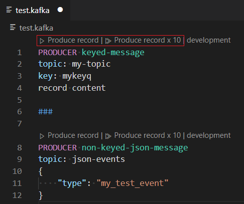

The log about produced messages is printed in the `Kafka Producer Log` Output view.

The `PRODUCER` block defines:

 * `keyed message` which is declared after PRODUCER *[optional]*.
 * `key`: the key *[optional]*.
 * `key-format` : [serializer](#Serializer) to use for the key *[optional]*.
 * `headers`: the headers of message comma separated list in format `key=value` *[optional]*
 * `value-format` : [serializer](#Serializer) to use for the value *[optional]*.
 
 * the rest of the content is the value until `###`.

### Serializer

The serializers can have the following value:

   * `string`: similar serializer to the Kafka Java client [org.apache.kafka.common.serialization.StringSerializer](https://github.com/apache/kafka/blob/master/clients/src/main/java/org/apache/kafka/common/serialization/StringSerializer.java). By default it supports `UTF-8` encoding, but you can specify the encoding as parameter like this `string(base64)`. The valid encoding values are defined in [Node.js' buffers and character encodings](https://nodejs.org/api/buffer.html#buffer_buffers_and_character_encodings).
   * `double`: similar serializer to the Kafka Java client [org.apache.kafka.common.serialization.DoubleSerializer](https://github.com/apache/kafka/blob/master/clients/src/main/java/org/apache/kafka/common/serialization/DoubleSerializer.java).
   * `float`: similar serializer to the Kafka Java client [org.apache.kafka.common.serialization.FloatSerializer](https://github.com/apache/kafka/blob/master/clients/src/main/java/org/apache/kafka/common/serialization/FloatSerializer.java).
   * `integer`: similar serializer to the Kafka Java client [org.apache.kafka.common.serialization.IntegerSerializer](https://github.com/apache/kafka/blob/master/clients/src/main/java/org/apache/kafka/common/serialization/IntegerSerializer.java).
   * `long`: similar serializer to the Kafka Java client [org.apache.kafka.common.serialization.LongSerializer](https://github.com/apache/kafka/blob/master/clients/src/main/java/org/apache/kafka/common/serialization/LongSerializer.java).
   * `short`: similar serializer to the Kafka Java client [org.apache.kafka.common.serialization.ShortSerializer](https://github.com/apache/kafka/blob/master/clients/src/main/java/org/apache/kafka/common/serialization/ShortSerializer.java). 

### Completion

Completion snippets can help you quickly bootstrap new `PRODUCER` blocks:

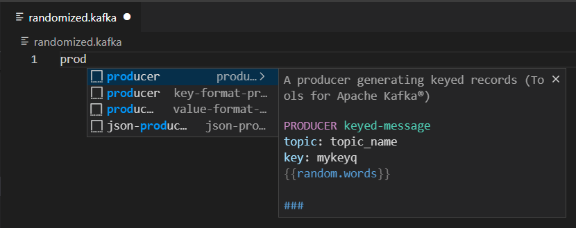

Completion is available for 

 * property name:

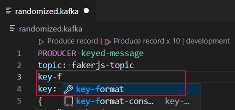

 * property value:

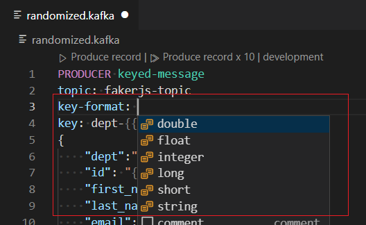

 * string encoding:
 
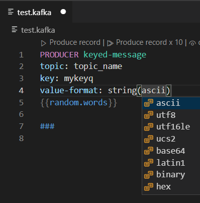

 * randomized content (see following section):
 
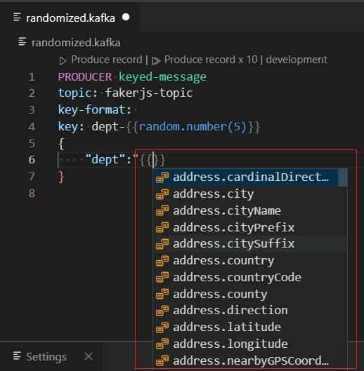

 * topic:
 
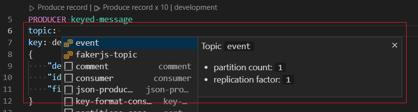

### Validation

Validation will help you write valid producers in .kafka files.

 * here is an example of value validation:

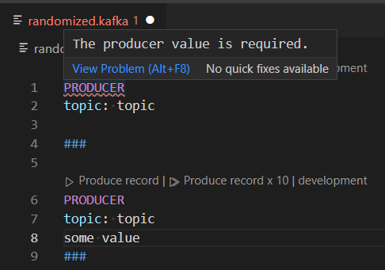

 * here is an example with FakerJS validation:
 
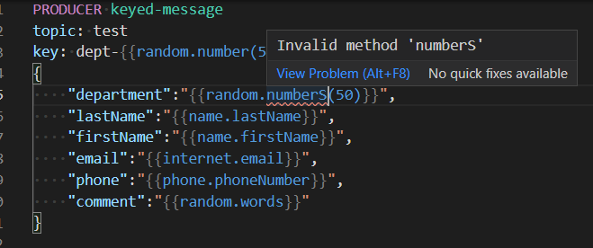

 * Existing topic validation is done only when cluster is `connected`. If the topic doesn't already exist, an error will be reported if the broker configuration is accessible and `auto.create.topics.enable=false`.


 
### Hover
 
Hover for properties documentation and topic informations is available in .kafka files.

Here is an example of hover on topic:

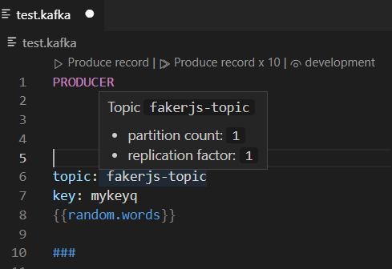

## Randomized content

Record content can be randomized by injecting mustache-like placeholders of [faker.js properties](https://github.com/Marak/faker.js#api-methods), like ``{{name.lastName}}`` or ``{{random.number}}``. Some randomized properties can be localized via the `kafka.producers.fakerjs.locale` setting.

The same seed is used for randomizing the key, the headers and the value, so the same randomized content can be injected in all places, as long as the same field is injected first in the message body.

For instance:

```
--- Produce random messages with built-in faker.js support
--- Message body simply needs to follow the mustache template syntax
--- See available fake data at https://github.com/marak/Faker.js/#api-methods

PRODUCER keyed-message
topic: fakerjs-topic
headers: messageId={{random.uuid}}, version={{system.semver}}
key: dept-{{random.number(5)}}
{
    "dept":"{{random.number(5)}}",
    "id": "{{random.uuid}}",
    "first_name": "{{name.firstName}}",
    "last_name": "{{name.lastName}}",
    "email": "{{internet.email}}",
    "country": "{{address.country}}"
}
```

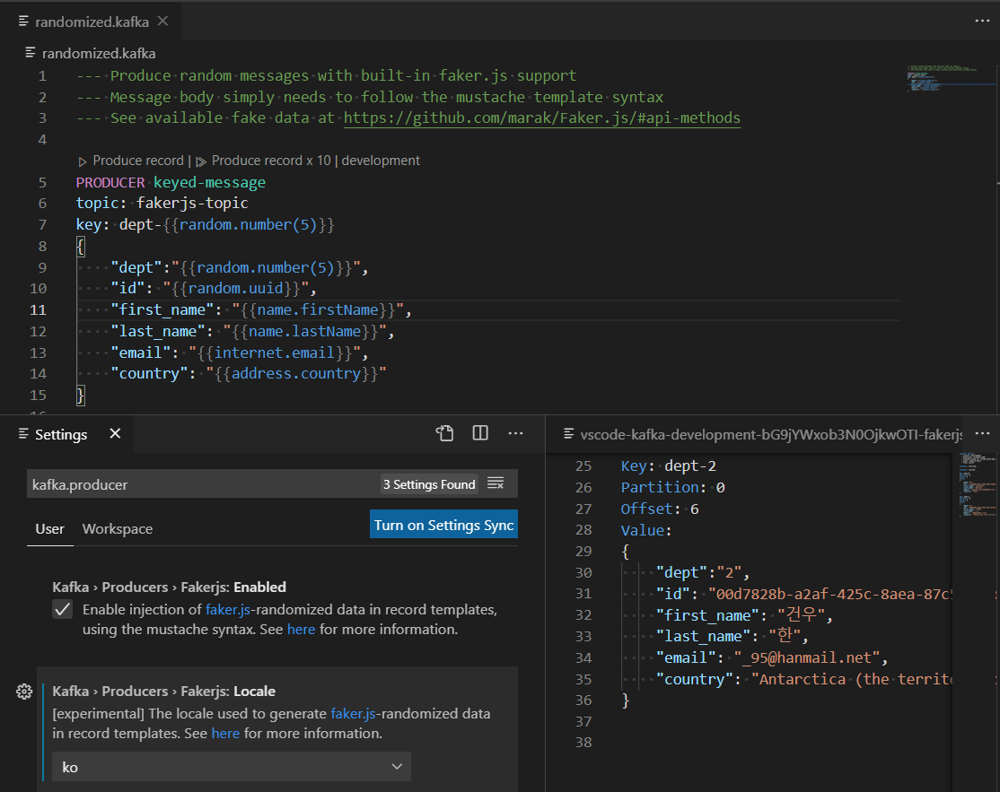

### `kafka.producers.fakerjs.enabled`

Enable injection of [faker.js](https://github.com/marak/Faker.js/#api-methods)-randomized data in record templates, using the mustache syntax.

### `kafka.producers.fakerjs.locale`

[experimental] The locale used to generate [faker.js](https://github.com/marak/Faker.js/#api-methods)-randomized data in record templates.