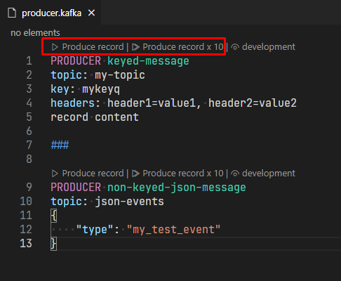

# Producing messages

Define simple producers in a [.kafka](KafkaFile.md#kafkafile) file, using the following format:

```
PRODUCER keyed-message
topic: my-topic
key: mykeyq
record content

###

PRODUCER non-keyed-json-message
topic: json-events
{
    "type": "my_test_event"
}
```

To produce a single record, click on the `Produce record` link above the `PRODUCER` line; to produce 10 records, click on `Produce record x 10`.



The log about produced messages is printed in the `Kafka Producer Log` Output view.

## Randomized content

Record content can be randomized by injecting mustache-like placeholders of [faker.js properties](https://github.com/Marak/faker.js#api-methods), like ``{{name.lastName}}`` or ``{{random.number}}``. Some randomized properties can be localized via the `kafka.producers.fakerjs.locale` setting.

The same seed is used for randomizing the key and the value, so the same randomized content can be injected in both places, as long as the same field is injected first in the message body.

For instance:

```
--- Produce random messages with built-in faker.js support
--- Message body simply needs to follow the mustache template syntax
--- See available fake data at https://github.com/marak/Faker.js/#api-methods

PRODUCER keyed-message
topic: fakerjs-topic
key: dept-{{random.number(5)}}
{
    "dept":"{{random.number(5)}}",
    "id": "{{random.uuid}}",
    "first_name": "{{name.firstName}}",
    "last_name": "{{name.lastName}}",
    "email": "{{internet.email}}",
    "country": "{{address.country}}"
}
```


### `kafka.producers.fakerjs.enabled`

Enable injection of [faker.js](https://github.com/marak/Faker.js/#api-methods)-randomized data in record templates, using the mustache syntax.

### `kafka.producers.fakerjs.locale`

[experimental] The locale used to generate [faker.js](https://github.com/marak/Faker.js/#api-methods)-randomized data in record templates.